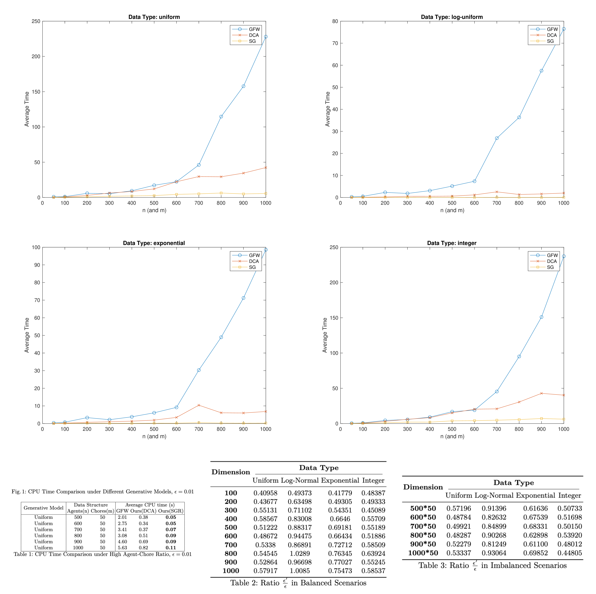

# Computing Competitive Equilibrium for Chores: Linear Convergence and Lightweight Iteration
Official implementation of "Computing Competitive Equilibrium for Chores: Linear Convergence and Lightweight Iteration".

The preliminery version is accepted by WINE 2024. See https://arxiv.org/abs/2410.04036 for the paper.

Move to the folder-main to test algorithms on demos and reproduce our results.

## Results Overview
This figure aggregates the main experimental results in a single page. The top row shows CPU time comparisons under different generative models, and the bottom row summarizes the tabular metrics from the paper.

